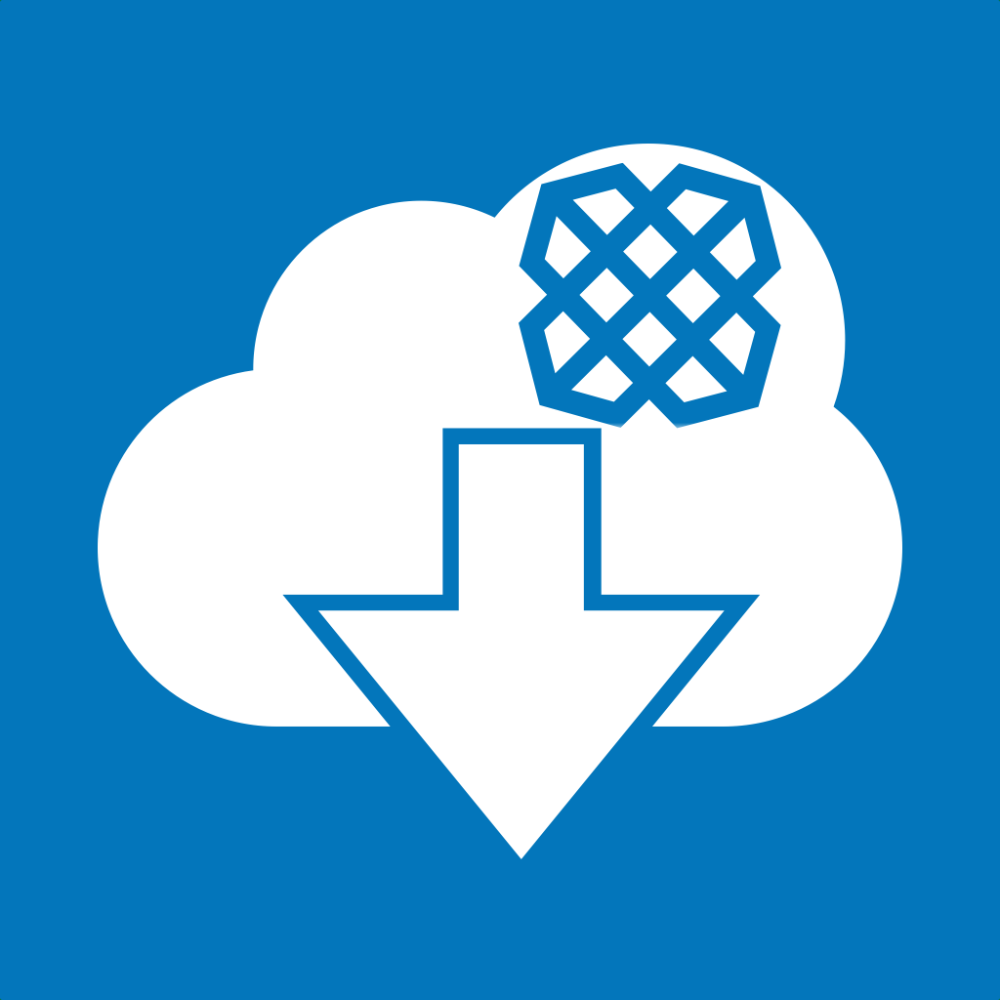

<a name="readme-top"></a>
<!-- PROJECT SHIELDS -->
[![Contributors][contributors-shield]][contributors-url]
[![Forks][forks-shield]][forks-url]
[![Stargazers][stars-shield]][stars-url]
[![Issues][issues-shield]][issues-url]
[![MIT License][license-shield]][license-url]


<!-- PROJECT LOGO -->
<br />
<div align="center">
  <a href="https://github.com/michaelpmaley/plaid-transaction-downloader">
    
  </a>
  <h3 align="center">Plaid Transaction Downloader</h3>
  <p align="center">
    Electron application that will download the latest transactions for linked financial institutions.
  </p>
</div>


<!-- TABLE OF CONTENTS -->
<details>
  <summary>Table of Contents</summary>
  <ol>
    <li>
      <a href="#about-the-project">About The Project</a>
      <ul>
        <li><a href="#built-with">Built With</a></li>
      </ul>
    </li>
    <li>
      <a href="#getting-started">Getting Started</a>
      <ul>
        <li><a href="#prerequisites">Prerequisites</a></li>
        <li><a href="#installation">Installation</a></li>
      </ul>
    </li>
    <li><a href="#usage">Usage</a></li>
    <li><a href="#license">License</a></li>
    <li><a href="#contact">Contact</a></li>
  </ol>
</details>


<!-- ABOUT THE PROJECT -->
## About The Project

[![Product Name Screen Shot][product-screenshot]]()

This application downloads new transactions from a linked financial institution to a csv file. It will:
* generate each file in the ~/Downloads folder
* patch the Payee and Category fields based upon a mappings file

**IMPORTANT**: This application is **NOT** intended for commerical use. There are several HACKs that loosen up web security features.

**IMPORTANT**: This application has only been tested in the Plaid sandbox environment.

<p align="right">(<a href="#readme-top">back to top</a>)</p>

### Built With

* [![React][React.js]][React-url]


<!-- GETTING STARTED -->
## Getting Started

### Prerequisites

1. Create a transaction mapping file, `/Users/<user>/Library/Application Support/plaid-transaction-downloader/transaction-mappings.json`.
It is a basic json dictionary, for example:
```json
{
   "AA WINDOW & GUTTER": {"payee": "AA Window & Gutter", "category": "Home"},
   "ADTSECURITY": {"payee": "ADT Security ↺", "category": "Bills & Utilities"},
   "ALASKA AIRLINES": {"payee": "Alaska Airlines", "category": "Travel"},
}
```
where the key is a regular expression that will match on payee field.

2. Create a Plaid account.
3. Under Team Settings > API, add `https://localhost:3000/main_window` as a Redirect URI.
4. Create a configuration file, `/Users/<user>/Library/Application Support/plaid-transaction-downloader/plaidConfig.json`.
```json
{
   "headers": {
      "clientName": 'CompanyName',
      "clientId": 'abc123def456',
      "secret": 'xxx999xxx999xxx',
      "environment": 'production',
   },
   "items" : [
   ],
}
```
where clientName is the Team Settings > Company page `Company name` value; and clientId, secret, and environment are the Team Settings > Keys page values.


### Installation

1. Clone the repo.
   ```sh
   git clone https://github.com/michaelpmaley/plaid-transaction-downloader.git
   ```

2. Install NPM packages.
   ```sh
   npm install
   ```

<p align="right">(<a href="#readme-top">back to top</a>)</p>


<!-- USAGE EXAMPLES -->
## Usage

Either run via `npm run start` or create a .app using `npm run make`.

<p align="right">(<a href="#readme-top">back to top</a>)</p>


<!-- LICENSE -->
## License

Distributed under the MIT License. See `LICENSE` for more information.

<p align="right">(<a href="#readme-top">back to top</a>)</p>


<!-- CONTACT -->
## Contact

Your Name - [@twitter_handle](https://twitter.com/twitter_handle) - email@email_client.com

Project Link: [https://github.com/michaelpmaley/plaid-transaction-downloader](https://github.com/michaelpmaley/plaid-transaction-downloader)

<p align="right">(<a href="#readme-top">back to top</a>)</p>


<!-- MARKDOWN LINKS & IMAGES -->
<!-- https://www.markdownguide.org/basic-syntax/#reference-style-links -->
[contributors-shield]: https://img.shields.io/github/contributors/michaelpmaley/plaid-transaction-downloader.svg?style=for-the-badge
[contributors-url]: https://github.com/michaelpmaley/plaid-transaction-downloader/graphs/contributors
[forks-shield]: https://img.shields.io/github/forks/michaelpmaley/plaid-transaction-downloader.svg?style=for-the-badge
[forks-url]: https://github.com/michaelpmaley/plaid-transaction-downloader/network/members
[stars-shield]: https://img.shields.io/github/stars/michaelpmaley/plaid-transaction-downloader.svg?style=for-the-badge
[stars-url]: https://github.com/michaelpmaley/plaid-transaction-downloader/stargazers
[issues-shield]: https://img.shields.io/github/issues/michaelpmaley/plaid-transaction-downloader.svg?style=for-the-badge
[issues-url]: https://github.com/michaelpmaley/plaid-transaction-downloader/issues
[license-shield]: https://img.shields.io/github/license/michaelpmaley/plaid-transaction-downloader.svg?style=for-the-badge
[license-url]: https://github.com/michaelpmaley/plaid-transaction-downloader/blob/master/LICENSE.txt
[product-screenshot]: images/screenshot.png
[React.js]: https://img.shields.io/badge/React-20232A?style=for-the-badge&logo=react&logoColor=61DAFB
[React-url]: https://reactjs.org/
